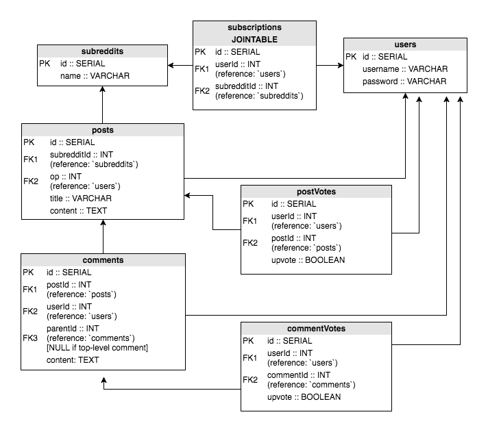

# React + Node Starter
_for [Heroku](https://www.heroku.com/) deployment_

## Overview

This is a simple starter to get you up and running for React projects. This is intended to provide:

* a lightweight webpack config (for development and production)
* some helpful tooling for development workflow
* a similar setup to what you'll see in the wild
* Heroku-ready deployment setup

## Running

Install dependencies: `$ npm install` or `$ yarn`

Fire up a development server: `$ npm run dev`

Once the server is running, you can visit `http://localhost:3000/`

## File layout

- **Frontend React**
    - The top level application Container is in `frontend/containers/AppContainer.js`
    - CSS styles are in `frontend/assets/stylesheets/base.scss`
- **Backend Express**
    - Entry point is `server.js`
    - API routes are under `backend/routes.js`
    - API routes are served under `http://localhost:3000/api`

## Production Build

To build your production assets and run the server:

```
$ npm start
```

## Deploying to Heroku

This app is set up for deployment to Heroku!

_This assumes you have already have a Heroku account and have the
[Heroku CLI](https://devcenter.heroku.com/articles/heroku-cli) installed_

```
$ heroku login
$ heroku create -a name-of-your-app
$ git push heroku master
$ heroku open
```

Heroku will follow the `build` command in your `package.json` and compile assets with `webpack.prod.config.js`. It runs the Express web server in `server.js`.

If you're unfamiliar with Heroku deployment (or just need a refresher), they have a really great walkthrough [here](https://devcenter.heroku.com/articles/getting-started-with-nodejs#introduction).

## Running on Glitch

1. Go to https://glitch.com/edit/#!/horizons-hackathon-react and click
  `Remix this 🎤`
1. Click `Show` at the top to preview your app!
